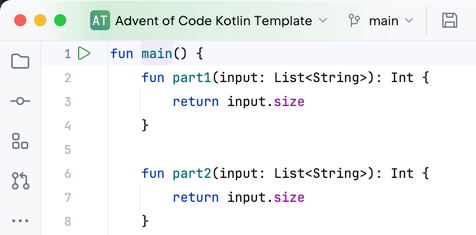

# Advent of Code Kotlin Template

[Advent of Code][aoc] – an annual event in December since 2015.
Every year since then, with the first day of December, a programming puzzles contest is published every day for twenty-four days.
A set of Christmas-oriented challenges provide any input you have to use to answer using the language of your choice.
We offer you a template prepared to use with [Kotlin][kotlin] language within this repository.

![][file:cover]

## Workflow
**Advent of Code Kotlin Template** is a particular type of GitHub repository that lets you speed up the setup phase and start writing your AoC solutions immediately.

The general idea is straightforward – to create a new project based on this template, you need to log in to your GitHub account and use the **Use this template** green button.
And remember – **do not fork it!**

After creating a new project based on this template in your account, a dedicated GitHub Actions workflow will start and clean up the code from redundant files.
It will also personalize code to use your username and project name in namespaces and Gradle properties.
How cool is that?

Right after the [@actions-user][actions-user] actor pushes the second commit to your repository, you're ready to clone it within the IntelliJ IDEA.

From now, everything's in your hands!
Join the [Advent of Code][aoc] contest, solve the *Day 01* as soon as it is published.

For the following days, copy the `Day01.kt` solution file and increment the day number.

> [!NOTE]
>
> Remember to join the Kotlin contest!
> 
> To do that, edit your project's _About_ section with ⚙️ icon and add the `aoc-2023-in-kotlin` topic to your project.
> 
> **We will find your repository and count you in our giveaway.** 

## Setup

After you create a new project based on the current template repository using the **Use this template** button, a bare minimal scaffold will appear in your GitHub account with the following structure:

```
.
├── README.md               README file
├── build.gradle.kts        Gradle configuration created with Kotlin DSL
├── settings.gradle.kts     Gradle project settings
├── gradle*                 Gradle wraper files
└── src
    ├── Day01.kt            An empty implementation for the first AoC day
    ├── Utils.kt            A set of utility methods shared across your days
    │                       
    │                       (files needed to be manually created)
    ├── Day01.txt           An empty file for the Day 01 input data
    └── Day01_test.txt      An optional Day 01 test input data used for checks
```

> [!NOTE]
>
> All task input files (`src/*.txt`) are excluded from the repository with `.gitignore` – we should not post them publicly, as [Eric Wastl requested for](https://twitter.com/ericwastl/status/1465805354214830081).

When the first puzzle appears, go to the `Day01.kt` and for each `part1` and `part2` functions, provide an algorithm implementation using the `input` data loaded from the `src/Day01.txt` file.
This input data is common for both parts, and you can find it on the bottom of each day on the [Advent of Code][aoc] page.

To read the input data, you can go with the `readInput(name: String)` utility method provided in the [`Utils.kt`][file:utils] file, like:

```kotlin
fun main() {
    fun part1(input: List<String>): Int {
        return input.size
    }

    val input = readInput("Day01")
    println(part1(input))
}
```

## Running

To call the algorithm you're implementing, click on the green Play button next to the `fun main()` definition.



> [!IMPORTANT]
>
> Before running tasks or tests, make sure to create relevant files, like: `src/Day01.txt` or `src/Day01_test.txt`.

The [`Utils.kt`][file:utils] file also contains the `String.md5()` method for generating MD5 hash out of the given string and expects more helper functions for the sake of the [KISS principle][kiss].

Each puzzle describes some test conditions, a small portion of the information that helps check if the produced value for the given test input is valid.
To handle that case, you can put such an input into a separated file and perform a check against the output, like:

```kotlin
fun main() {
    // ...
    
    val testInput = readInput("Day01_test")
    check(part1(testInput) == 13)
}
```

The current approach of providing both `part1` and `part2` solutions within the single `Day##.kt` file may sometimes bring a disadvantage due to the first solution calculation when we expect to work on the second part only.
With simple cases that don't consume too much of your time and resources that can be almost unnoticeable, but when solution takes seconds, it is worth considering breaking daily solution into two separated pieces, like `Day07_part1.kt` and `Day07_part2.kt`.

The final result of your algorithm will be printed on the screen so that you can pass it to the Advent of Code website.

To go with the next day, place the `Day02.txt` file into the `src` with relevant input data and create `Day02.kt` file with a similar code scaffold:

```kotlin
fun main() {
    fun part1(input: List<String>): Int {
        return 0
    }

    fun part2(input: List<String>): Int {
        return 0
    }

    val input = readInput("Day02")
    println(part1(input))
    println(part2(input))
}
```

> [!NOTE]
> 
> There is a fork of this repository available which utilizes the Amper tool for project configuration, recently [introduced by JetBrains][amper].
> 
> For more, see: [Advent of Code Kotlin Template — Amper][amper-template] project.

## Getting help

If you stuck with Kotlin-specific questions or anything related to this template, check out the following resources:

- [Kotlin docs][docs]
- [Kotlin Slack][slack]
- Template [issue tracker][issues]


[actions-user]: https://github.com/actions-user
[aoc]: https://adventofcode.com
[amper]: https://blog.jetbrains.com/blog/2023/11/09/amper-improving-the-build-tooling-user-experience/
[amper-template]: https://github.com/kotlin-hands-on/advent-of-code-kotlin-template-amper
[docs]: https://kotlinlang.org/docs/home.html
[issues]: https://github.com/kotlin-hands-on/advent-of-code-kotlin-template/issues
[kiss]: https://en.wikipedia.org/wiki/KISS_principle
[kotlin]: https://kotlinlang.org
[slack]: https://surveys.jetbrains.com/s3/kotlin-slack-sign-up
[file:cover]: .github/readme/cover.png
[file:utils]: src/Utils.kt
